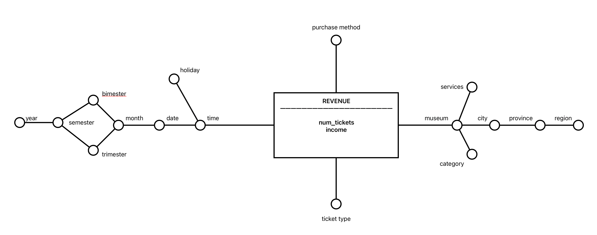

# Homework 1

## 1

### Conceptual Schema

{width=100%}

### Logical Schema

#### Fact Table

Revenue(<u>MuseumID, TimeID, PurchaseMethodID</u>, NumTickets, Income)

#### Dimension Tables

Museum(<u>MuseumID</u>, Museum, Category, CityID, ServicesID)
City(<u>CityID</u>, City, Province, Region)
Services(<u>ServicesID</u>, S1, S2, S3, S4, S5, S6, S7, S8, S9, S10)
PurchaseMethod(<u>PurchaseMethodID</u>, PurchaseMethod, TicketType)
Time(<u>TimeID</u>, DateTime, Date, Holiday, Month, Bimester, Trimester, Semester, Year)

## 2

### 2.1

```sql
SELECT TicketType, Month,
    SUM(TotalAmount)/ COUNT(DISTINCT Date),
    SUM(SUM(TotalAmount)) OVER (PARTITION BY Year
          ORDER BY Month
       ROWS UNBOUNDED PRECEDING) AS Cumulative,
    SUM(Quantity)/SUM(SUM(Quantity)) OVER (PARTITION BY Month) * 100 AS Percentage
FROM Revenue r, Time t, PurchaseMethod p
WHERE r.TimeID = t.TimeID and r.PurchaseMethodID = p.PurchaseMethodID
GROUP BY TicketType, Month, Year
ORDER BY Month, TicketType, Year;

```

### 2.2

```sql
SELECT r.MuseumID, TicketType,
    SUM(Income)/SUM(NumTickets) AS AverageRevenueForTicket,
    SUM(Income)/SUM(SUM(Income)) OVER (PARTITION BY Category) * 100,
    RANK() OVER (PARTITION BY TicketType ORDER BY SUM(NumTickets) DESC) AS ranking
FROM Revenue r, Museum m, PurchaseInfo p, Time t
WHERE r.MuseumID = m.MuseumID AND r.PurchaseMethodID = p.PurchaseMethodID AND t.TimeID = r.TimeID AND Year = 2021
GROUP BY t.MuseumID, TicketType, Category
ORDER BY Ranking, TicketType, MuseumID

```

## 3

```sql
SELECT TicketType, Semester, SUM(Income) / COUNT(DISTINCT Month)
FROM Revenue r, Time t, PurchaseMethod p
WHERE r.PurchaseMethodID = p.PurchaseMethodID AND r.TimeID = t.TimeID
GROUP BY TicketType, Semester, Month
ORDER BY TicketType, Month

SELECT TicketType, Year,
  SUM(SUM(Income)) OVER (PARTITION BY Year
         ORDER BY Month
         ROWS UNBOUNDED PRECEDING)
FROM Revenue r, Time t, PurchaseMethod p
WHERE r.TimeID = t.TimeID AND r.PurchaseMethodID = p.PurchaseMethodID
GROUP BY TicketType, Month
ORDER BY TicketType, Month

SELECT TicketType, Month,
  SUM(NumTickets),
  SUM(Income),
  SUM(Income)/SUM(NumTickets)
FROM Revenue r, Time t, PurchaseMethod p
WHERE r.PurchaseMethodID = p.PurchaseMethodID AND r.TimeID = t.TimeID AND p.PurchaseMethod = "Online"
GROUP BY TicketType, Month
ORDER BY TicketType, Month

SELECT TicketType, Month,
  SUM(NumTickets),
  SUM(Income),
  SUM(Income)/SUM(NumTickets)
FROM Revenue r, Time t, PurchaseMethod p
WHERE r.PurchaseMethodID = p.PurchaseMethodID AND r.TimeID = t.TimeID AND t.Year=2021
GROUP BY TicketType, Month
ORDER BY TicketType, Month

SELECT SUM(NumTickets) / SUM(SUM(NumTickets)) OVER (PARTITION BY Month) * 100
FROM Revenue r, Time t, PurchaseMethod p
WHERE r.TimeID = t.TimeID AND r.PurchaseMethodID = p.PurchaseMethodID
GROUP BY TicketType, Month
ORDER BY TicketType, Month
```

### 3.1

```sql
CREATE MATERIALIZED VIEW MAT_VIEW AS
 SELECT TicketType, Semester, Month, Year, PurchaseMethod,
  SUM(NumTickets),
  SUM(Income),
 FROM Revenue r, Time t, PurchaseMethod p,
 WHERE r.TimeID = t.TimeID AND r.PurchaseMethodID = p.PurchaseMethodID
 GROUP BY TicketType, Semester, Month, Year, PurchaseMethod

```

### 3.2

```sql
CREATE MATERIALIZED VIEW LOG ON Revenue
WITH SEQUENCE, ROWID
(TimeID, PurchaseMethodID, NumTickets, Income)
INCLUDING NEW VALUES;

CREATE MATERIALIZED VIEW LOG ON Time
WITH SEQUENCE, ROWID
(TimeID, Month, Semester, Year)
INCLUDING NEW VALUES;

CREATE MATERIALIZED VIEW LOG ON PurchaseMethod
WITH SEQUENCE, ROWID
(PurchaseMethodID, PurchaseMethod, TicketType)
INCLUDING NEW VALUES;

```

### 3.3

The materialized view is refreshed whenever an update or an insertion is performed either on the Revenue, Time or PurchaseMethod tables.

## 4

### 4.1

```sql
CREATE TABLE VM1(
 TicketType INTEGER NOT NULL
 ,Semester VARCHAR(6) NOT NULL
 ,Month VARCHAR(7) NOT NULL
 ,Year INTEGER NOT NULL
 ,PurchaseMethod VARCHAR(30) NOT NULL
 ,NumTickets INTEGER NOT NULL
 ,Income INTEGER NOT NULL
 ,PRIMARY KEY(TicketType, PurchaseMethod, Month)
)

```

### 4.2

```sql
INSERT INTO VM1(TicketType, Semester, Month, Year, PurchaseMethod,NumTickets, Income)
 (SELECT TicketType, Semester, Month, Year, PurchaseMethod,
  SUM(NumTickets),
  SUM(Income),
 FROM Revenue r, Time t, PurchaseMethod p,
 WHERE r.TimeID = t.TimeID AND r.PurchaseMethodID = p.PurchaseMethodID
 GROUP BY TicketType, Semester, Month, Year, PurchaseMethod);

```

### 4.3

```sql
CREATE TRIGGER RefreshViewRevenue
AFTER INSERT ON Revenue
FOR EACH ROW
DECLARE
N number;
varTicketType INTEGER, varSemester VARCHAR(6), varMonth VARCHAR(7), varYear INTEGER, varPurchaseMethod VARCHAR(30);

BEGIN
SELECT Semester, Month, Year INTO varSemester, varMonth, varYear
FROM Time
WHERE TimeID = :NEW.TimeID:;

SELECT TicketType, PurchaseMethod INTO varTicketType, varPurchaseMethod
FROM PurchaseMethod
WHERE PurchaseMethodID = :NEW.PurchaseMethodID:;

SELECT COUNT(*) INTO N
FROM VM1
WHERE Month = varMonth AND TicketType = vatTicketType AND PurchaseMethod = varPurchaseMethod
IF (N > 0) THEN
 UPDATE VM1
 SET Income = Income + :NEW.Income
  NumTickets = NumTickets + :NEW.NumTickets
 WHERE Month = varMonth AND TicketType = vatTicketType AND PurchaseMethod = varPurchaseMethod;
ELSE
 INSERT INTO VM1(TicketType, Semester, Month, Year, PurchaseMethod, Income, NumTickets)
 VALUES (varTicketType, varSemester, varMonth, varYear, varPurchaseMethod, :NEW.Income, :NEW.NumTickets);
END IF;
END;

```

### 4.4

The trigger is activated after an insertion on the Revenue table.
