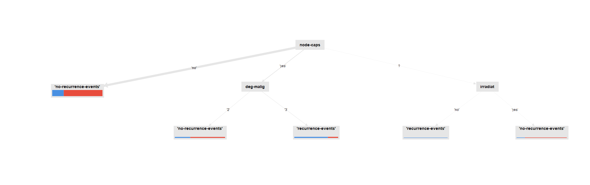

# Homework 2

## Question 1

### Most discriminative attribute

The attribute that was deemed the most discriminative for the recurrance of the disease was the `breast` attribute, with a weight of `0.253`

### Decision tree height

The height of the decision tree generated is `7`.

### Pure partitions

The `node-caps -- no --> irradiat -- no --> tumor-size -- 0-4 --> menopause -- ge40 --> no-recurrence-event` is a pure leaf partition in the tree

{height=65%}

## Question 2

{width=100%}

This is the original tuple of configuration values, the tables of weights for each attribute is as follows:

| Attribute   | Weight               |
| ----------- | -------------------- |
| breast      | 0.2532550974160511   |
| menopause   | 0.23805216502842008  |
| irradiat    | 0.14435823064078993  |
| inv-nodes   | 0.11028606216489178  |
| deg-malig   | 0.09565463631753374  |
| breast-quad | 0.07938395975554524  |
| age         | 0.0683047025088976   |
| node-caps   | 0.007801823805608859 |
| tumor-size  | 0.002903322362261681 |

{width=100%}

We notice that by halving the maximum depth of the tree, the most significant attribute becomes `irradiat`, with a weight of `0.352`

| Attribute   | Weight               |
| ----------- | -------------------- |
| irradiat    | 0.35258774682691774  |
| deg-malig   | 0.0984743548059487   |
| tumor-size  | 0.007091219430150039 |
| node-caps   | 0.019055563818908165 |
| breast-quad | 0.10703518944505139  |
| inv-nodes   | 0.09866675322109492  |
| breast      | 0.30045027740853664  |
| age         | 0.016638895043392433 |

{width=100%}

We see that by further reducing the maximum depth of the tree the table of weights changes again, in particular there is not enough depth to take into account more than three attributes so we end up with `irradiat`, `deg-malig` and `node-caps` as the most significant attributes.

| Attribute | Weight              |
| --------- | ------------------- |
| irradiat  | 0.7242905594804206  |
| deg-malig | 0.20005362846304608 |
| node-caps | 0.07565581205653318 |

{width=100%}

A minimal gain of `0.1` is too high for the tree to be able to split the data, so the tree is a single node with the most common class.

{width=100%}

With a minimal gain of `0.05` the tree is able to split the data, the table of weights is as follows:

| Attribute | Weight               |
| --------- | -------------------- |
| irradiat  | 0.46895231084037786  |
| deg-malig | 0.06922665308270236  |
| node-caps | 0.026179973315981146 |
| inv-nodes | 0.13555584033360638  |
| breast    | 0.2772254512663664   |
| age       | 0.022859771160966044 |

## Question 3

After performing cross-validation on the dataset with the decision trees with parameters `max_depth` and `min_gain` with values equal to the ones in the previous question, we obtain the following results.

| max_depth | min_gain | accuracy                                 |
| --------- | -------- | ---------------------------------------- |
| 10        | 0.01     | 67.48% +/- 6.59% (micro average: 67.48%) |
| 5         | 0.01     | 70.28% +/- 7.75% (micro average: 70.28%) |
| 3         | 0.01     | 74.82% +/- 6.64% (micro average: 74.83%) |
| 10        | 0.1      | 70.30% +/- 1.43% (micro average: 70.28%) |
| 10        | 0.05     | 70.64% +/- 6.20% (micro average: 70.63%) |

So the maximum accuracy is achieved with a maximum depth of `3` and a minimal gain of `0.01`.

{width=100%}

{width=100%}

{width=100%}

{width=100%}

{width=100%}

## Question 4

We have to take into account that bias and variance are inversely proportional, when varying the values of `K` we are trying to find a balance between the two that minimizes the error. A larger `K` leads to lower variance and higher bias, while a smaller `K` leads to higher variance and lower bias. Having a large bias means that the model is not able to capture the complexity of the data and is **underfitting**, while having a large variance means that the model is too complex and is classifying noise, so it is **overfitting**.

| K   | Accuracy                                 |
| --- | ---------------------------------------- |
| 3   | 70.26% +/- 7.23% (micro average: 70.28%) |
| 5   | 73.77% +/- 5.98% (micro average: 73.78%) |
| 7   | 74.84% +/- 6.23% (micro average: 74.83%) |
| 9   | 75.20% +/- 5.18% (micro average: 75.17%) |
| 11  | 73.45% +/- 5.57% (micro average: 73.43%) |

We can see that the best accuracy is achieved with `K=9`. The accuracy using the Naïve Bayes classifier is `72.45% +/- 7.70% (micro average: 72.38%)` so the KNN classifier with `K=9` is better and the average of the accuracies for the KNN classifier is `73,504` so the KNN is better all around in this case.

{width=100%}

{width=100%}

{width=100%}

{width=100%}

{width=100%}

{width=100%}

## Question 5

The data for the correlation matrix can be visualized with the following table:

{width=100%}

while the data of the pairwise table is the following (Only the first 10 and last 10 rows are shown):

| Attribute 1 | Attribute 2 | Correlation          |
| ----------- | ----------- | -------------------- |
| inv-nodes   | irradiat    | 0.39911819719082897  |
| age         | menopause   | 0.24059243233053124  |
| breast      | breast-quad | 0.1751707189626296   |
| tumor-size  | deg-malig   | 0.13273721749621958  |
| menopause   | node-caps   | 0.13013151242614435  |
| node-caps   | deg-malig   | 0.09784272338880319  |
| menopause   | breast      | 0.07689126686592174  |
| age         | breast      | 0.06720918629451157  |
| inv-nodes   | breast-quad | 0.0627920149528649   |
| tumor-size  | node-caps   | 0.05761736321041181  |
| ...         | ...         | ...                  |
| tumor-size  | breast-quad | -0.05634086948449663 |
| deg-malig   | breast      | -0.07327153260340742 |
| deg-malig   | irradiat    | -0.07416583658042385 |
| menopause   | irradiat    | -0.07510818380013956 |
| menopause   | breast-quad | -0.09556274857769992 |
| tumor-size  | inv-nodes   | -0.13128441345283084 |
| menopause   | deg-malig   | -0.1612529644952651  |
| node-caps   | irradiat    | -0.1966134284809648  |
| inv-nodes   | deg-malig   | -0.21292888705047638 |
| inv-nodes   | node-caps   | -0.46515754241618157 |

So the two most correlated attributes are `inv-nodes` and `irradiat` with a correlation of `0.39911819719082897`, not all the features are equally as important so the naïve indipendence assumption is not valid.
